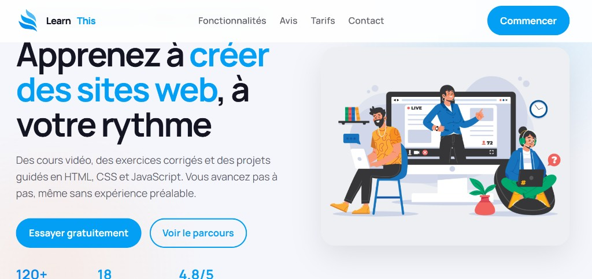

<div align="center">

# 🎓 LearnThis

**Landing page e-learning moderne avec 6 sections, combinateurs CSS avancés et carrousel sans JavaScript**

[](https://developer.mozilla.org/fr/docs/Web/HTML)
[](https://developer.mozilla.org/fr/docs/Web/CSS)
[](https://akieni.com)
[](https://validator.w3.org/)

[](#)
[](#)
[](https://github.com/Chal-B/landing_page)

[Aperçu ](#-Aperçu ) · [Installation](#-installation) · [Architecture](#-architecture-du-projet) · [Contribuer](#-contribuer) · [Contact](#-contact)

</div>

---

## 📖 Table des matières

- [À propos](#-à-propos)
- [Fonctionnalités](#-fonctionnalités)
- [Aperçu ](#-Aperçu )
- [Prérequis](#-prérequis)
- [Installation](#-installation)
- [Utilisation](#-utilisation)
- [Architecture du projet](#-architecture-du-projet)
- [Technologies utilisées](#-technologies-utilisées)
- [Tests](#-tests)
- [Contribuer](#-contribuer)
- [Contact](#-contact)

---

##  À propos

LearnThis est une landing page pour une plateforme d'apprentissage du développement web. Elle guide le visiteur du hero à l'inscription en **6 sections** : Hero, Fonctionnalités, Témoignages, Tarifs, CTA et Footer.

> 💡 Design SaaS moderne, header sticky, skip-link et focus visible — le tout en HTML + CSS pur.

##  Fonctionnalités

- ✅ **6 sections** — structure complète type produit tech
- ✅ **Combinateurs CSS** — `>`, `+`, `~`, `:nth-child`, `:first-of-type`
- ✅ **Carrousel témoignages** — animation CSS sans JavaScript
- ✅ **3 plans tarifaires** — comparaison visuelle claire
- ✅ **Accessibilité** — skip-link, `aria-label`, contrastes

##  Aperçu 



🔗 **Fichier à ouvrir** : `index.html`

##  Prérequis

- Navigateur web moderne
- *(Optionnel)* [Live Server](https://marketplace.visualstudio.com/items?itemName=ritwickdey.LiveServer)

##  Installation

```bash
git clone https://github.com/Chal-B/landing_page.git
cd landing_page
```

Ouvrir **`index.html`** dans le navigateur.

##  Utilisation

Projet statique — parcourir les sections via la navigation (Fonctionnalités, Avis, Tarifs, Contact) ou le défilement.

##  Architecture du projet

```
landing_page/
├── index.html          # ~409 lignes
├── style.css           # ~1036 lignes
├── icones/             # learnthis.svg, html5, css, js…
├── images/             # Hero + 3 portraits témoignages
├── preview.png
└── README.md
```

## Technologies utilisées

| Catégorie | Technologie |
|---|---|
| Structure | HTML5 sémantique |
| Styles | CSS3 avancé — variables, combinateurs, animations |
| Typographie | Manrope (Google Fonts) |
| Couleur primaire | `#039ff4` |
| Validation | W3C HTML + CSS |

##  Tests

- [Validateur HTML W3C](https://validator.w3.org/#validate_by_input)
- [Validateur CSS W3C](https://jigsaw.w3.org/css-validator/)

## 📬 Contact

**MALONGA Saint Chalbhery** — [GitHub @Chal-B](https://github.com/Chal-B) — saintmlg@icloud.com

Lien du projet : [https://github.com/Chal-B/landing_page](https://github.com/Chal-B/landing_page)

---
